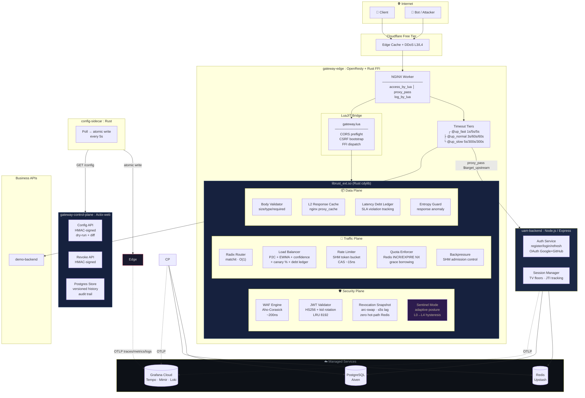
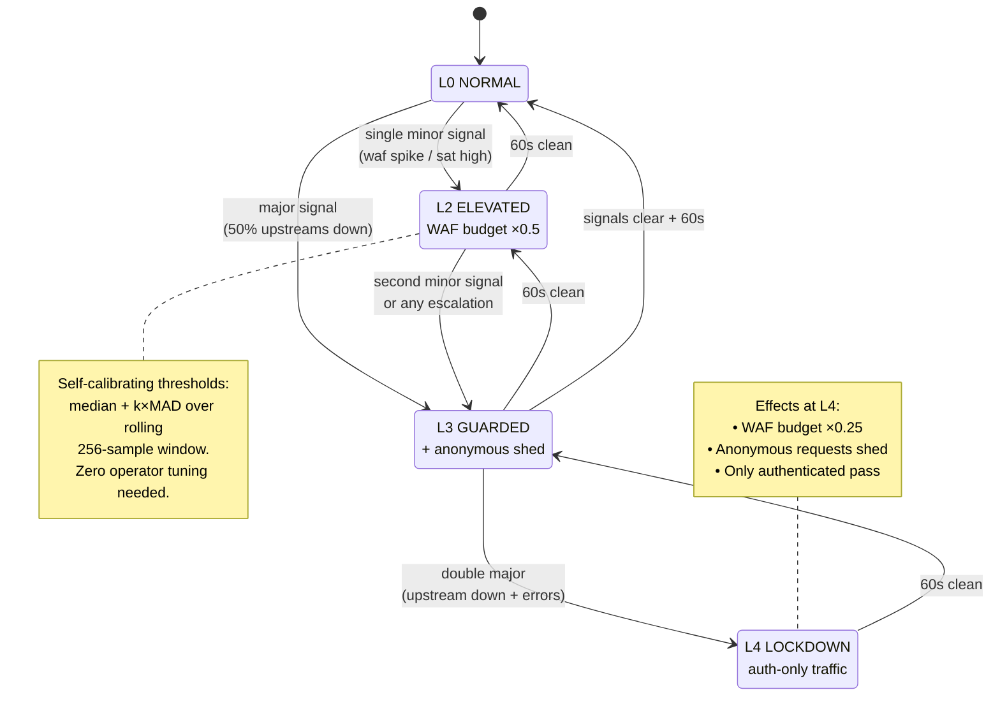
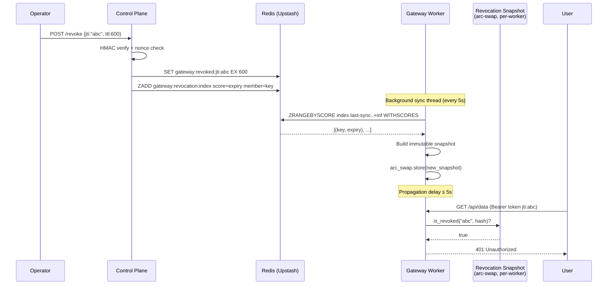
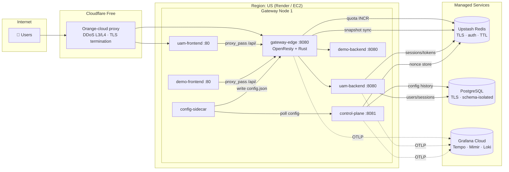

# Architecture

> Every box below is real code you can read. No magic. No hand-waving.

## System Overview

---

## Request Lifecycle

Every request traverses this exact pipeline. Each step shows its measured cost.

```mermaid
sequenceDiagram
    participant C as Client
    participant N as nginx worker
    participant L as LuaJIT
    participant R as Rust FFI
    participant B as Backend
    participant RD as Redis

    C->>N: GET /api/users/42<br/>Authorization: Bearer eyJ...
    
    Note over N,L: ─── access_by_lua phase ───
    N->>L: access_by_lua_block
    L->>L: CORS preflight check<br/>(204 if OPTIONS)
    L->>L: Strip X-User-Id/X-Home-Region<br/>(anti-spoofing)
    L->>L: Read body (first 8KB for WAF)
    
    L->>R: process_request(auth,path,body,...)<br/>═══ RUST HOT PATH ═══
    
    rect rgb(30, 30, 50)
        Note over R: ── WAF ── (~200ns)
        R->>R: URI decode ×3 passes
        R->>R: Aho-Corasick pattern match
        R->>R: Per-IP rate limit (SHM CAS)
        R->>R: Body scan (NUL-safe)
        
        Note over R: ── JWT Validation ── (~150ns cache hit)
        R->>R: Header parse + alg pinning
        R->>R: HMAC-SHA256 verify (constant-time)
        R->>R: exp/nbf/iat checks
        R->>R: LRU cache lookup
        R->>R: Revocation snapshot check (~100ns)
        R->>R: TV floor check (snapshot)
        
        Note over R: ── Routing ── (~50ns)
        R->>R: Radix tree match → service + tier
        
        Note over R: ── Rate Limit ── (~15ns)
        R->>R: SHM token bucket CAS
        
        Note over R: ── Quota ── (~50ns when enabled)
        R->>RD: INCR quota:{svc}:{user}:{day}
        RD-->>R: count
        
        Note over R: ── Load Balancing ── (~20ns)
        R->>R: Ring hash + P2C + EWMA<br/>× confidence score<br/>× latency debt penalty
        R-->>L: upstream="uam-backend:8080"<br/>region="US" tier="normal"
    end
    
    L->>L: Set target_upstream/target_tier<br/>Set X-Request-ID/X-User-Id headers
    L->>L: ngx.exec("@up_" .. tier)

    Note over N,B: ─── proxy_pass phase ───
    N->>B: GET /api/users/42<br/>X-Request-ID: abc123<br/>X-User-Id: user42<br/>X-Tier: normal
    
    B-->>N: 200 OK {"data":...}
    N-->>C: 200 OK (with CORS headers,<br/>security headers, X-Cache-Status)

    Note over N,R: ─── log_by_lua phase ───
    N->>L: log_by_lua_block
    L->>R: report_telemetry(status, latency_us, upstream)
    R->>R: Latency debt ledger update
    R->>R: EWMA latency record
    R->>R: OTLP span export (batched)
    L->>L: release_slot() [backpressure]
```

---

## Adaptive Defense Posture (Sentinel Mode)

The gateway's immune system. Signals fuse into one posture; effects cascade automatically.

---

## Revocation Flow (Zero Hot-Path Redis)

How tokens are revoked in ≤5 seconds without touching Redis on the hot path.

---

## Deployment Topology

---

## Graceful Degradation Matrix

What happens when each dependency fails? This is the complete policy map.

| Dependency | Consumer | On failure | Policy | User impact |
|---|---|---|---|---|
| **Redis** (Upstash) | edge revocation snapshot | Sync fails → snapshot goes stale | Fail-closed if >20s old + FAIL_CLOSED=1; else serve stale | 401 after staleness threshold |
| **Redis** (Upstash) | edge rate-limit fleet sync | Sync fails → local CAS only | Fail-open (local limits still enforced) | None |
| **Redis** (Upstash) | edge quota counters | INCR times out | Fail-open (allow) | None |
| **Redis** (Upstash) | uam session/cache pool | Connection error | Circuit breaker → fail-open silently | None (cache miss) |
| **Redis** (Upstash) | uam distributed rate limit | Circuit OPEN | **Fail-closed** (strict mode) or degrade to local | 503 or degraded limiting |
| **PostgreSQL** | uam identity DB | Connection refused | Boot exits(1) — identity is critical | Service down |
| **PostgreSQL** | cp config history | Write fails before apply | Reject change (fail-closed for auditability) | Config push rejected |
| **PostgreSQL** | cp durable store | Pool timeout | In-memory history fallback | Rollback unavailable |
| **Backend API** | edge proxy | Timeout / 5xx | Circuit breaker opens → skip upstream; try next in ring | 503 if no healthy upstream |
| **Control plane** | sidecar config fetch | Poll timeout | Keep last known-good config | Stale routes continue serving |

---

## Key Design Decisions

| # | Decision | Approach | Why |
|---|----------|----------|-----|
| 002 | Data-plane language | Rust cdylib via Lua FFI | Memory safety + zero-GC + NGINX ecosystem |
| 003 | Hot-path design | Lock-free atomics, SHM mmap | ~450 ns p50, zero allocation per request |
| 005 | JWT validation | Local HS256, 8192-entry LRU | No network round-trip per request |
| 006 | WAF | Aho-Corasick automaton | Single-pass, zero heap, ~200 ns |
| 009 | Load balancing | Consistent hash + P2C + EWMA | Sticky routing, latency-aware, fault-tolerant |
| 010 | Backpressure | SHM admission control | Prevents cascading failure under load |
| 038 | Revocation keys | `jti` preferred, sha256(token) fallback | Opaque, collision-free, per-token precision |
| 053 | Token-version floor | Redis counter per user | O(1) kill-all-sessions on password reset |
| 066 | Revocation snapshot | arc-swap, background sync every 5s | Zero hot-path Redis; fail-closed guard |
| 0071 | Sentinel Mode | Cross-signal adaptive posture L0–L4 | Self-calibrating defense without tuning |
| 0072 | Soft circuit breaker | Confidence-scored routing | Continuous health vs binary ejection |
| 0073 | Quota borrowing | Grace % of future allowance | Better UX than hard cutoff |
| 0075 | Gradient concurrency | TCP Vegas applied to HTTP proxy | Limit self-discovers backend capacity |
| 0076 | Single-flight collapsing | In-flight registry, leader/follower | Eliminates thundering herd at source |
| 0077 | Latency debt ledger | SLA violations accumulate as decaying debt | Natural credit market for upstream traffic |

Full decision index: [`docs/decisions/README.md`](docs/decisions/README.md)
