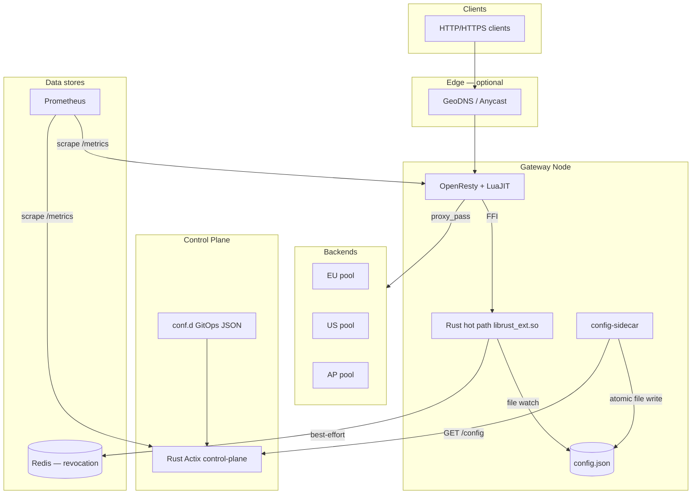
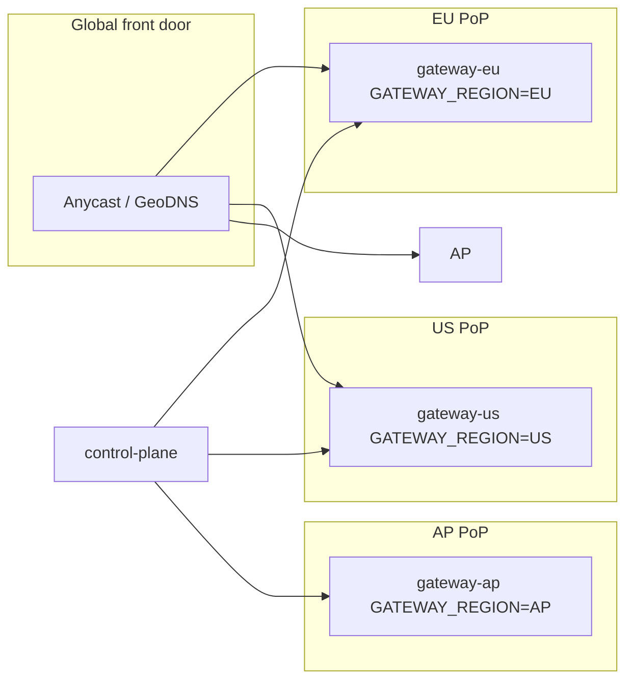

# Architecture Overview

This document is the **map** of the system. Every box below links to an
Architecture Decision Record (ADR) that explains *why* that choice was made and
*what alternatives were rejected*.

> **Start here:** [`decisions/README.md`](decisions/README.md) — **52 ADRs** covering
> every significant design choice.

---

## System context

---

## Request path (7 stages, ~300–600 ns Rust overhead)

See [`REQUEST_LIFECYCLE.md`](REQUEST_LIFECYCLE.md) for the full walkthrough.

| Stage | Component | ADR |
|-------|-----------|-----|
| 0 | Backpressure admit | [0010](decisions/0010-backpressure-admission-control.md) |
| 1 | WAF (URI + body + bots) | [0006](decisions/0006-waf-aho-corasick.md) |
| 2 | JWT auth + LRU cache | [0005](decisions/0005-local-jwt-validation.md) |
| 3 | Path routing + data residency | [0014](decisions/0014-data-residency-identity-routing.md) |
| 4 | Per-user rate limit | [0007](decisions/0007-rate-limiting-token-bucket-shared-memory.md) |
| 5 | Load balance (hash + EMA + CB) | [0009](decisions/0009-load-balancing-consistent-hash-ema.md) |
| 6 | Admit + identity headers → upstream | [0040](decisions/0040-identity-headers-to-upstream.md) |
| 7 | `proxy_pass` to upstream | [0001](decisions/0001-rust-plus-openresty-nginx.md) |

After the response: telemetry + circuit-breaker update in `log_by_lua` (ADR-0008, ADR-0015).

---

## Component responsibilities

### Data plane — `gateway/`

| Piece | Role |
|-------|------|
| `rust-ext/` | Rust cdylib: all hot-path logic, unit-tested |
| `lua/gateway.lua` | Thin FFI bridge (`access` / `log` / `metrics` / `health` / `ready`) |
| `nginx.conf` | TLS, epoll, reuseport, L2 cache policy, security |
| `gateway-locations.conf` | Hot path wiring, proxy headers, `/health` `/ready` `/metrics` |

**Why Lua-FFI and not a native NGINX module?** → [ADR-0002](decisions/0002-lua-ffi-data-plane-over-native-module.md)

### Control plane — `gateway-control-plane/`

Versioned GitOps config: push, rollback, history, signed mutations, **`POST /revoke`**.
Lock-free reads (`ArcSwap`), mutex only on writes.

→ [ADR-0011](decisions/0011-control-plane-gitops.md), [ADR-0039](decisions/0039-control-plane-revoke-api.md)

### Config sidecar — `gateway-sidecar/`

One per node. Polls control plane, writes `config.json` atomically.
Gateway workers watch the file — no per-worker HTTP polling.

→ [ADR-0012](decisions/0012-config-distribution-sidecar-file-watch.md)

### Cross-worker state — shared memory (mmap)

Rate limits, WAF counters, circuit breakers, telemetry — all lock-free across
NGINX worker processes on the same node.

→ [ADR-0003](decisions/0003-lock-free-hot-path.md), [ADR-0004](decisions/0004-shared-memory-cross-worker-state.md)

---

## Multi-region topology

→ [ADR-0018](decisions/0018-multi-region-anycast.md), [ADR-0014](decisions/0014-data-residency-identity-routing.md)

---

## Observability

| Signal | Mechanism | ADR |
|--------|-----------|-----|
| Metrics | Prometheus pull `/metrics` | [0015](decisions/0015-observability-prometheus-pull.md) |
| Logs | JSON access log + `X-Request-ID` | [0015](decisions/0015-observability-prometheus-pull.md) |
| Traces | OTel collector (tail sampling) | [0015](decisions/0015-observability-prometheus-pull.md) |
| Dashboards | Grafana auto-provisioned | `platform/monitoring/grafana/` |
| Alerts | `platform/monitoring/prometheus/rules/` | [0015](decisions/0015-observability-prometheus-pull.md) |

---

## Deployment options

| Environment | How |
|-------------|-----|
| Local dev | `docker compose up` — see [README](../README.md) |
| Multi-region sim | `docker compose -f docker-compose.multi-region.yml up` |
| Kubernetes | [`platform/deploy/kubernetes/`](../platform/deploy/kubernetes/) reference manifests |
| Production checklist | [`PRODUCTION.md`](PRODUCTION.md) |

→ [ADR-0019](decisions/0019-deployment-and-kernel-tuning.md)

---

## What we deliberately did *not* build

| Alternative | Why not (see ADR) |
|-------------|-------------------|
| Pure Rust proxy (Pingora) | NGINX edge maturity first — [0001](decisions/0001-rust-plus-openresty-nginx.md) |
| Native NGINX C-API module (shipped) | Immature `ngx` crate — [0002](decisions/0002-lua-ffi-data-plane-over-native-module.md) |
| Redis on hot path for rate limits | Network latency — [0007](decisions/0007-rate-limiting-token-bucket-shared-memory.md) |
| OAuth introspection per request | Too slow — [0005](decisions/0005-local-jwt-validation.md) |
| ModSecurity inline | Latency + ops burden — [0006](decisions/0006-waf-aho-corasick.md) |
| JWT secret in config API | Blast radius — [0013](decisions/0013-secrets-via-environment-not-config-wire.md) |
| eBPF in default image | Privileged NIC ops — optional infra only — [0042](decisions/0042-optional-ebpf-xdp-ddos-filter.md) |
