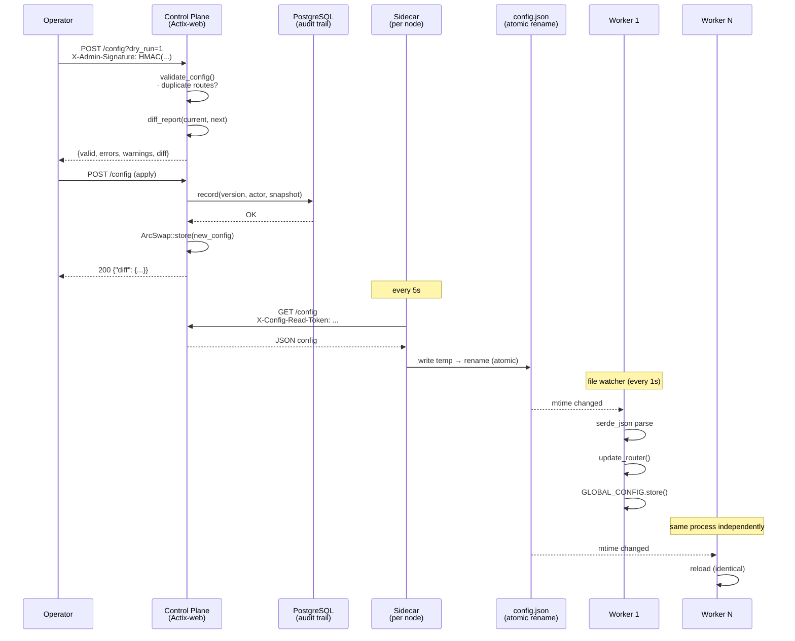
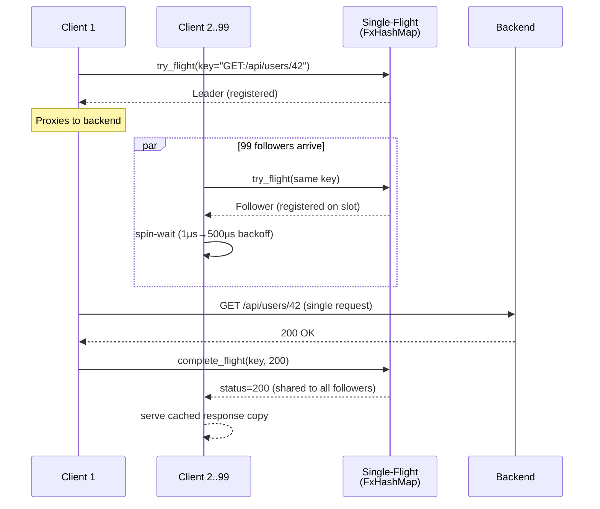
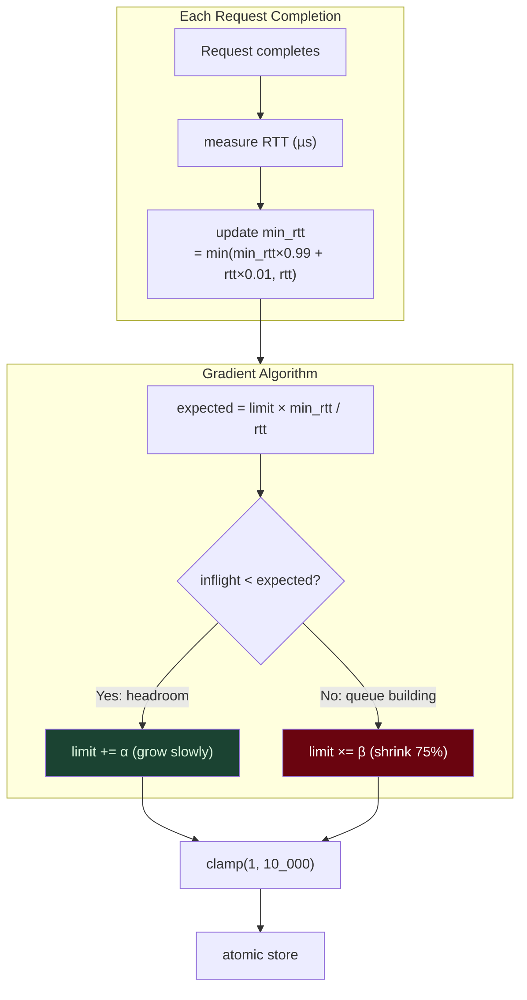
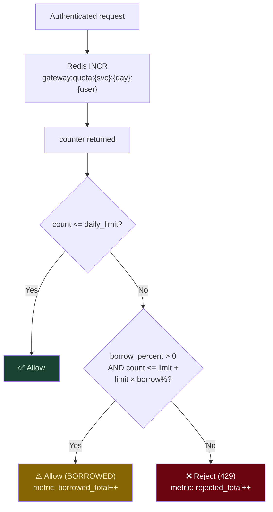
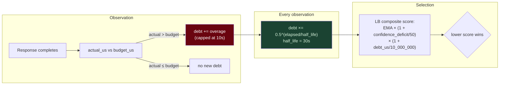
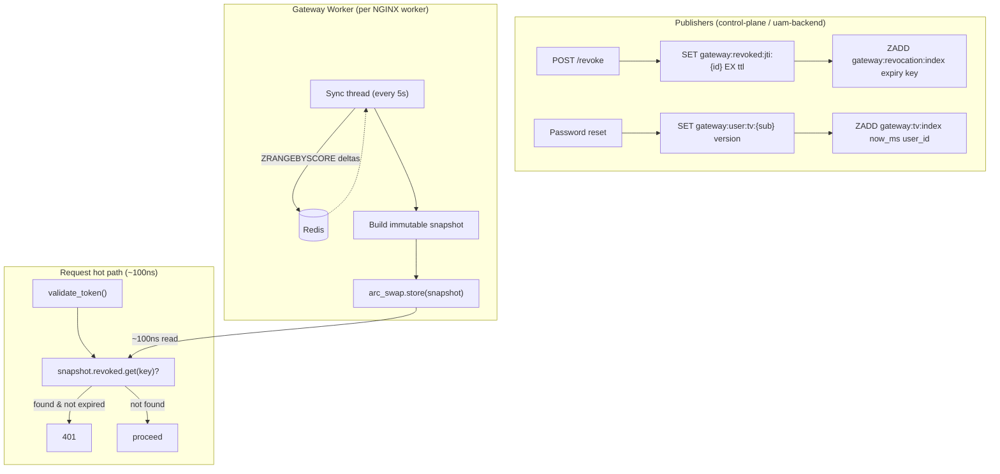
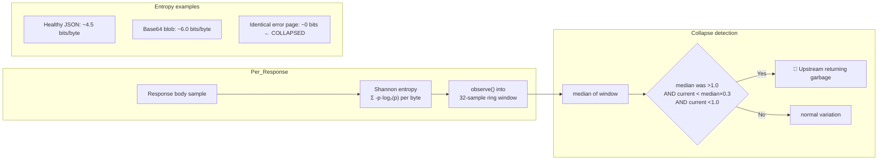

# Diagrams

> Every diagram is generated from real code. If it's drawn here, it works.

---

## 1. Security Defense-in-Depth

Seven layers of protection between attacker and data.

```mermaid
graph LR
    subgraph L1["Layer 1 · Network"]
        CF["Cloudflare Free<br/>DDoS L3/L4<br/>TLS termination"]
    end
    subgraph L2["Layer 2 · Transport"]
        TLS["TLS 1.2/1.3<br/>ECDHE ciphers<br/>HSTS preload"]
    end
    subgraph L3["Layer 3 · Edge WAF"]
        AC["Aho-Corasick<br/>pattern scan"]
        IPRL["Per-IP rate limit<br/>SHM CAS ~15ns"]
        TRAV["Traversal guard<br/>raw + decoded"]
        BSCAN["Body scan<br/>NUL-safe 8KB"]
    end
    subgraph L4["Layer 4 · Auth"]
        JWTV["JWT HS256<br/>alg pinned<br/>kid rotation"]
        REVOC["Revocation snapshot<br/>≤5s propagation"]
        TVF["Token-version floor<br/>kill-all-sessions"]
    end
    subgraph L5["Layer 5 · Authorization"]
        CSRF["CSRF double-submit<br/>cookie+header match"]
        RES["Data-residency<br/>region enforcement"]
    end
    subgraph L6["Layer 6 · Adaptive"]
        SENT["Sentinel Mode<br/>L0→L4 posture"]
        CONFCB["Soft circuit breaker<br/>confidence scoring"]
        GRAD["Gradient concurrency<br/>self-discovering limit"]
    end
    subgraph L7["Layer 7 · Backend"]
        VAL["Input validation<br/>zod schema"]
        RLIM["Auth rate limiter<br/>20/hr strict"]
        BCOST["bcrypt cost 12<br/>+ pepper"]
    end

    L1 --> L2 --> L3 --> L4 --> L5 --> L6 --> L7

    style L3 fill:#2d1b4e,color:#c4b89c
    style L4 fill:#1a1a2e,color:#e0e0e0
    style L6 fill:#16213e,color:#e0e0e0
```

---

## 2. Config Distribution Pipeline

How a config change reaches every worker without downtime.

---

## 3. Single-Flight Collapsing

100 identical concurrent GETs → exactly 1 backend hit.

---

## 4. Gradient Concurrency Limiter

The limit self-discovers the backend's true carrying capacity.

---

## 5. Quota Grace Borrowing

Users who exhaust their allowance get grace before hard rejection.

---

## 6. Latency Debt Ledger

Upstreams accumulate debt when slow; debt decays; selection prefers low-debt.

---

## 7. Revocation Snapshot (Zero Hot-Path Redis)

Tokens revoked fleet-wide in ≤5 seconds without any Redis call on the hot path.

---

## 8. Response Entropy Guard

Detecting the invisible failure: 200 OK with garbage.

