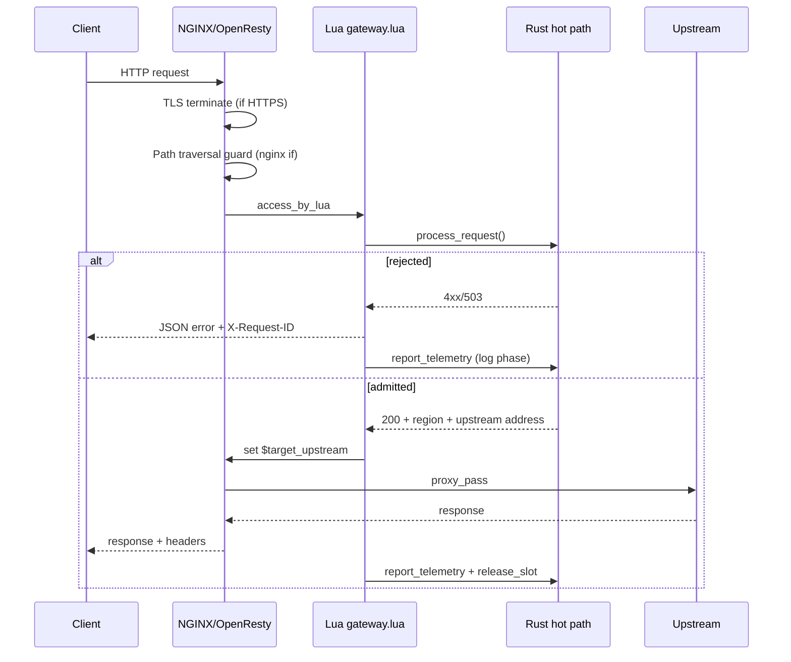

# Request Lifecycle

Every request through the gateway follows this path. Timings are **design
targets** for the Rust work only (excluding TLS, network, upstream).

---

## Phase diagram



---

## Stage-by-stage (Rust `process_request`)

### Stage 0 — Backpressure (~5 ns)

**What:** Increment global in-flight counter. If over `global_max_concurrency`
(or global circuit breaker is open), return **503** immediately.

**Why first:** Cheapest possible rejection under overload. No crypto, no parsing.

→ [ADR-0010](decisions/0010-backpressure-admission-control.md)

---

### Stage 1 — WAF (~200 ns)

**What:** Scan full request URI (path + query, URL-decoded), request body
(POST/PUT/PATCH, first 8 KB), and User-Agent against Aho-Corasick automata.
Anonymous clients also get per-IP rate limiting here.

**Outcomes:** 400 (oversized), 403 (injection/bot), 429 (IP limit).

**Why before auth:** Attackers should be rejected before we spend cycles on JWT.

→ [ADR-0006](decisions/0006-waf-aho-corasick.md)

---

### Stage 2 — JWT authentication (~50 ns cached, ~2–5 µs cold)

**What:** Parse `Authorization: Bearer`, verify HS256 signature, check
`exp`/`nbf`/`iat`/`iss`/`aud`, optional Redis revocation on cache miss,
thread-local LRU cache on hit.

**Outcomes:** Identity extracted (`user_id`, `home_region`) or `None`.

**Why local not introspection:** Sub-microsecond cached validation vs milliseconds
for a network round trip.

→ [ADR-0005](decisions/0005-local-jwt-validation.md)

---

### Stage 3 — Routing + data residency (~10 ns)

**What:**
1. Strip query string from path.
2. Radix-tree longest-prefix match → service config.
3. Compare JWT `home_region` to node's `GATEWAY_REGION` (403 on mismatch unless
   either side is `GLOBAL`).

**Outcomes:** 403 (residency violation), 404 (no route), service + region resolved.

→ [ADR-0014](decisions/0014-data-residency-identity-routing.md)

---

### Stage 4 — Auth enforcement

**What:** If `service.require_auth` and no valid identity → **401**.

Public routes (e.g. `/public/`) skip this.

---

### Stage 5 — Rate limiting (~15 ns)

**What:** Shared-memory token bucket keyed by user ID (or IP for anonymous).
Limit from `service.rate_limit_max`.

**Outcomes:** 429 if over limit.

→ [ADR-0007](decisions/0007-rate-limiting-token-bucket-shared-memory.md)

---

### Stage 6 — Load balancing (~20 ns)

**What:**
1. Consistent hash on `user_id` → primary upstream in region pool.
2. Skip upstreams with open circuit breakers.
3. Prefer alternative if EMA latency is >20% better.

**Returns:** `host:port` address for `proxy_pass`.

→ [ADR-0009](decisions/0009-load-balancing-consistent-hash-ema.md),
[ADR-0008](decisions/0008-circuit-breaker.md)

---

### Stage 7 — Admit

Write `target_region`, `target_upstream`, `X-Request-ID`, and (when authenticated)
`X-User-Id` / `X-Home-Region` for upstream `proxy_set_header`. Return 200 to Lua
→ fall through to `proxy_pass`.

→ [ADR-0040](decisions/0040-identity-headers-to-upstream.md)

---

## Post-response (`log_by_lua`)

1. `report_telemetry(status, latency_us, upstream)` — metrics + CB/EMA update.
2. `release_slot()` — decrement backpressure counter (only for admitted requests).

**Why split release from telemetry:** Prevents double-release bug on early rejects.

→ [ADR-0010](decisions/0010-backpressure-admission-control.md)

---

## NGINX layers (outside Rust)

| Layer | What | ADR |
|-------|------|-----|
| TLS termination | TLS 1.2/1.3, session cache, OCSP stapling | [0016](decisions/0016-tls-termination.md) |
| L2 cache | `proxy_cache` — **skipped when `Authorization` present** | [0017](decisions/0017-multi-layer-caching.md) |
| Security headers | HSTS, CSP, X-Frame-Options, etc. | [0016](decisions/0016-tls-termination.md) |
| Structured logs | JSON access log with region, upstream, timing | [0015](decisions/0015-observability-prometheus-pull.md) |

---

## Endpoints that bypass the hot path

| Path | Purpose |
|------|---------|
| `GET /health` | Liveness — process up, includes `config_version` |
| `GET /ready` | Readiness — config loaded (`gateway_config_ready 1`) |
| `GET /metrics` | Prometheus scrape (internal networks only) |

---

## Config refresh (background, not per-request)

```
control-plane ──HTTP──▶ config-sidecar ──file──▶ gateway workers
     ▲                      (every 5s)         (stat every 1s)
     │                                            │
     └── ArcSwap hot-swap on change ──────────────┘
```

Secrets (`JWT_SECRET`) injected from gateway environment, never from the file.

→ [ADR-0012](decisions/0012-config-distribution-sidecar-file-watch.md),
[ADR-0013](decisions/0013-secrets-via-environment-not-config-wire.md)
